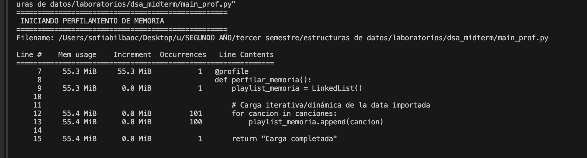
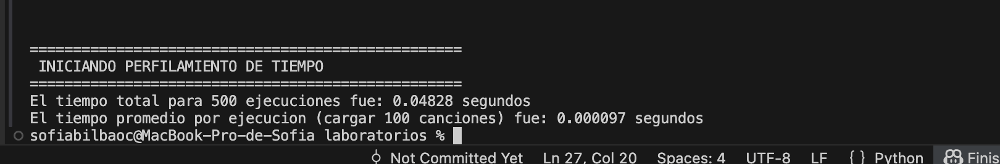

Examen parcial de Estructuras de Datos.
*Christian

1. Profiling del Metodo de Carga de Datos

Se realizo un perfilamiento de la carga iterativa de 100 canciones utilizando herramientas de Python para medir el rendimiento en tiempo y espacio.

Perfilamiento de Memoria (memory_profiler)
Se utilizo el decorador @profile para analizar el consumo de RAM linea por linea del archivo main_prof.py

Interpretacion: Como se observa en la captura, el incremento de memoria es constante y proporcional a la cantidad de nodos agregados. La complejidad espacial es O(n), ya que cada nodo nuevo que almacena el diccionario (nombre, artista, album) requiere un bloque de memoria adicional, creciendo linealmente conforme se insertan las 100 canciones.

Perfilamiento de Tiempo (timeit)
Se ejecuto el metodo de carga iterativa 500 veces para obtener un promedio.

Interpretacion: El tiempo de ejecucion refleja el metodo append. Al no guardar un puntero hacia la cola de la lista, cada insercion debe recorrer todos los nodos existentes con un bucle "while actual.next is not None". Esto resulta en una complejidad temporal de O(n) en el peor de los casos.

2. Mecanismo de Shuffle y Complejidad Temporal

Como activar y desactivar el Shuffle?
El modo aleatorio se controla mediante la funcion toggle_shuffle(). En la interfaz interactiva, se puede encender y apagar en cualquier momento presionando la tecla "s". 
Al encender el shuffle, se limpia el historial de saltos para evitar inconsistencias; al apagarlo, la playlist retoma su comportamiento lineal desde la cancion en la que te encuentras.

Funcionamiento y Complejidad
El mecanismo usado esta construidoe sobre la estructura de la Lista Enlazada usando navegacion de nodos:

Siguiente (n): Calcula un numero aleatorio de pasos entre 0 y el tamano total de la lista. Luego empezando desde el inicio, utiliza un ciclo for para saltar de nodo en nodo usando actual.next hasta llegar a la posicion deseada.

Anterior (p): Antes de cada salto aleatorio, el nodo actual se guarda en una pila llamada history. Si el usuario presiona "Anterior", el programa obtiene el ultimo nodo de este historial para regresar a la cancion de la que venia.

Complejidad Temporal Teorica:
La complejidad temporal del shuffle es O(n). Como la lista enlazada no tiene indices en memoria contigua, el programa esta forzado a recorrer secuencialmente los punteros desde el inicio para alcanzar la cancion aleatoria elegida.

3. Instrucciones de Ejecucion

Pasos para probar el proyecto de la playlist:

Paso 1. Clonar este repositorio en la terminal:
git clone https://github.com/sofiabilbaocr/dsa_midterm

Paso 4. Para abrir el reproductor interactivo y probar el Shuffle y demás opciones:
python playlist_demo.py

